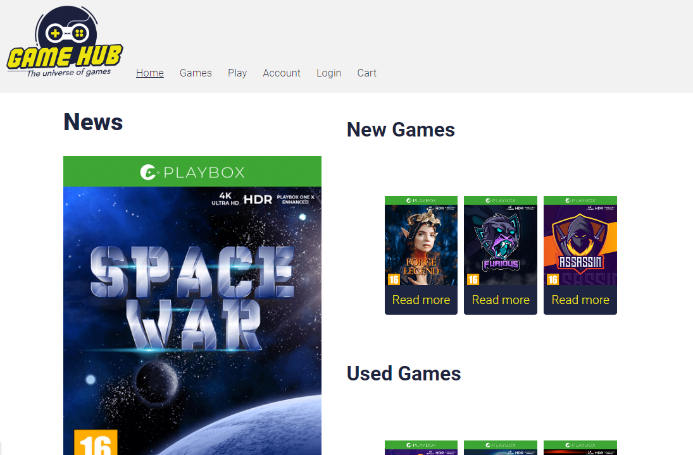

### Gamehub - Cross course project

---

The project was to design, and ultimately create the webpage we designed using html, css, and later javascript

## Description

A webpage designed to be responsive.
It should have a homepage, a listing page and a details page.
It hould also have a contact page and an account page.

- Responsive
- Easy to use
- WCAG

## Built with

- HTML
- CSS
- Javascript

## Contact

- [Linkedin](https://www.linkedin.com/in/ken-thore-bøeng-b2b1b3ba/)
